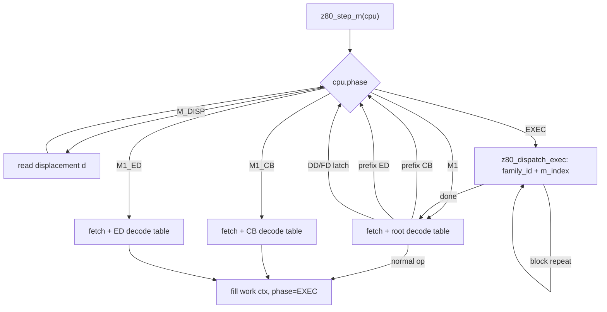
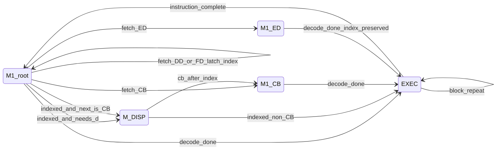
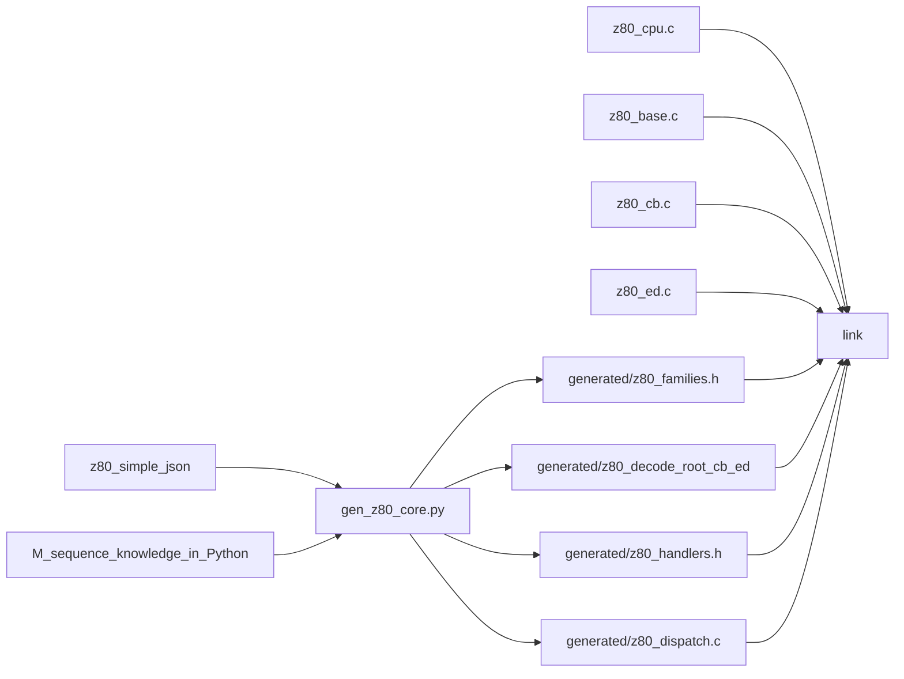

# Z80 M-cycle Simulator Core Design

## Goals (V1)

- **M-cycle accurate** enough for simple CPM machines (e.g. Kaypro-class): correct M sequences, lengths, and re-entry for block ops.
- **Not** T-state / bus-pin accurate (that would be a separate project; ignore WAIT/bus signals for now).
- **Full** root / CB / ED decode tables from [`z80_simple.json`](/Users/davidlevy/Projects/z80/z80_simple.json), [`z80_simple_cb.json`](/Users/davidlevy/Projects/z80/z80_simple_cb.json), [`z80_simple_ed.json`](/Users/davidlevy/Projects/z80/z80_simple_ed.json), **plus DD/FD via index latch and operand remapping** (indexed variants are not separate JSON entries).
- **C11** core; Python generates decode tables and `family_id` enum into `src/generated/` only; M-handler **bodies** stay hand-written.

## Architecture overview



`EXEC` is the phase enum `Z80_PH_EXEC` (M2..Mn after decode). The diagram label is the same phase; `m_index` starts at 2 for the first post-decode M-cycle.

## CPU and work context

Hand-written header (not generated), e.g. [`src/z80.h`](src/z80.h):

```c
typedef enum {
  Z80_PH_M1,
  Z80_PH_M1_CB,
  Z80_PH_M1_ED,
  Z80_PH_M_DISP,   /* read d after DD/FD before op or before M1_CB */
  Z80_PH_EXEC      /* M2..Mn: dispatch by family_id + m_index */
} z80_phase_t;

typedef enum { Z80_IDX_NONE, Z80_IDX_IX, Z80_IDX_IY } z80_index_t;

typedef struct {
  uint8_t (*mem_read)(void *ctx, uint16_t addr);
  void    (*mem_write)(void *ctx, uint16_t addr, uint8_t v);
  uint8_t (*io_read)(void *ctx, uint16_t port);
  void    (*io_write)(void *ctx, uint16_t port, uint8_t v);
  void *bus_ctx;
} z80_bus_t;

typedef struct {
  /* architectural */
  uint16_t af, bc, de, hl, ix, iy, sp, pc;
  uint16_t af_, bc_, de_, hl_;
  uint8_t i, r;
  uint8_t iff1, iff2, im;
  bool halted;

  /* bus */
  z80_bus_t bus;

  /* M-machine */
  z80_phase_t phase;
  z80_index_t index;     /* DD/FD latch; cleared when instruction completes */
  int8_t disp;           /* (IX/IY+d) */
  bool cb_after_index;   /* DD CB d op / FD CB d op */

  z80_family_t family;   /* generated enum */
  uint8_t m_index;       /* 2 = first post-decode M, etc. */
  uint8_t m_count;       /* planned Ms for this activation (may change for cond/block) */

  /* decoded work context — filled in M1*, consumed blindly in EXEC */
  z80_opnd_t dst, src;   /* kind: REG8, REG16, MEM_HL, MEM_IDX, IMM, ADDR, NONE */
  uint8_t alu_op;        /* for ALU family */
  uint8_t cc;            /* condition code field */
  bool cond_true;        /* evaluated once at decode when applicable */
  uint8_t tmp8;
  uint16_t tmp16;
  uint16_t addr;         /* effective address for mem/io */
  /* block-ops extras as needed: repeat flag, etc. */
} z80_t;
```

Operand descriptors are **kinds + register indices**, not live values. Values are read/written in the M that performs the bus/ALU step.

## Phase behavior

### M1 / M1_CB / M1_ED

1. If `halted`, return immediately (no bus activity). See [HALT (V1)](#halt-v1).
2. `opcode = mem_read(pc++);` bump R as appropriate for M1 (V1 can approximate R++).
3. Lookup `decode_root[opcode]` / `decode_cb[opcode]` / `decode_ed[opcode]` → `{ family, extract fields }` (`z80_decode_ent`).
4. Special cases (root map only, when `index == Z80_IDX_NONE`):
   - Root `CB` → `phase = M1_CB` (no family exec).
   - Root `ED` → `phase = M1_ED`.
   - Root `DD`/`FD` → set `index`, stay in `M1` (another opcode fetch).
5. When `index != Z80_IDX_NONE` (already latched):
   - A fetched `DD`/`FD` byte is an **opcode in indexed context**, not a re-latch.
   - If next byte is `CB`, set `cb_after_index`, go `M_DISP` then `M1_CB`.
   - If next is `ED`, go `M1_ED` with **`index` preserved**.
   - If indexed and op uses `(HL)` / needs `d` → `M_DISP` then EXEC with remapped mem operand.
6. Else: bind `dst`/`src`/`alu_op`/`cc` from fields; if conditional family, set `cond_true` from flags; set `m_index = 2`; **finalize `m_count` when entering EXEC** (after any `M_DISP` / prefix fetches — may shrink if `!cond_true`); `phase = EXEC`.

**PC rule:** PC increments in the M-cycle that performs the bus read (M1 opcode fetch, `M_DISP` for `d`, EXEC Ms for immediates / addresses).

### M_DISP

Read `d` from `mem_read(pc++)`, store `disp`, then transition to `M1_CB` or `EXEC` as planned.

### EXEC (M2..Mn) — `Z80_PH_EXEC`

[`src/z80_cpu.c`](src/z80_cpu.c) calls generated dispatch only — no inline family switch:

```c
z80_dispatch_exec(cpu);  /* generated/z80_dispatch.c */
```

Generated `z80_dispatch.c` owns the single `switch (cpu->family)`:

```c
switch (cpu->family) {
  case FAM_ALU_A_R: z80_m_alu_a_r(cpu); break;
  case FAM_LD_R_R:  z80_m_ld_r_r(cpu); break;
  case FAM_LD_RP_NN: z80_m_ld_rp_nn(cpu); break;
  ...
}
```

Each handler switches on `cpu->m_index` (or uses a small steps array). On last M: clear `index` / `cb_after_index`, `phase = M1`.

**Conditionals (JR_CC, RET_CC, CALL_CC, JP_CC):** `cond_true` set in M1; later Ms only perform taken-path bus work if true (match Z80 early decision).

**Block ops (LDI/LDIR/…):** same `family_id`; after one transfer unit, if repeat and BC≠0 (or CPIR match rules), **re-arm** `m_index` to the first transfer M without returning to M1 — like the real Z80, do not re-fetch the opcode each byte.

## Prefix / index state machine

DD/FD are **not** separate ISA files — `index` latch + remapping in operand binding / EA helpers. Remap rules follow [`z80_instruction_set.json`](/Users/davidlevy/Projects/z80/z80_instruction_set.json) `encoding_order` and `ix_iy_overrides` (HL→IX/IY, `(HL)`→`(IX+d)`/`(IY+d)`, including documented exceptions such as ops that touch both HL and IX/IY).



Key rules:

- **`index` preserved** through `M1_ED` (DD/FD + ED + op) and through `M1_CB` after displacement.
- After DD/FD is latched, a fetched `DD`/`FD` byte is an **opcode in indexed context**, not a re-latch.
- **`index` / `cb_after_index` cleared** only when the full instruction completes (return to M1).
- Remapping: HL→IX/IY, `(HL)`→`(IX+d)`/`(IY+d)`; apply documented exceptions from `ix_iy_overrides`.

## Decode: table + family_id (agreed verdict)

- **Decode:** `static const z80_decode_ent decode_root[256];` (and cb/ed). Entry holds `family` + how to extract ddd/sss/rp/alu/cc/bit.
- **Execute:** generated `z80_dispatch_exec` — one case per pattern family, named by **shape**: `FAM_LD_R_R`, `FAM_ALU_A_R`, `FAM_LD_RP_NN`, … (not mixed names like `FAM_ADD`). Matching “ADD A,B and ADD A,C are the same instruction after decode.”

### Decode → work-ctx contract

`z80_decode_ent` holds `{ family, field extractors }`. M1 / M1_CB / M1_ED bind `dst` / `src` / `alu_op` / `cc` / `cond_true` into the work context. EXEC handlers consume that work context blindly; they do **not** re-decode the opcode.

### Illegal / undocumented opcode policy

- Map root / CB / ED slots to appropriate families where documented (including known undocumented effects).
- Unknown slots → dedicated NOP / undocumented families (ED uses `FAM_ED_NOP`).
- Release builds: execute without crashing.
- Debug builds: optional `Z80_TRAP_UNDOC` assert on first hit of an undocumented / illegal family.
- Generator knowledge + [`z80_instruction_set.json`](/Users/davidlevy/Projects/z80/z80_instruction_set.json) supply remap / undocumented rules; [`z80_simple*.json`](/Users/davidlevy/Projects/z80/z80_simple.json) supply decode patterns.

## HALT (V1)

- `HALT` sets `cpu->halted = true`.
- While halted, `z80_step_m` returns immediately (no bus activity).
- Only `z80_reset` clears `halted` in V1 (interrupts still stubbed — no interrupt wake-up yet).

## Generated vs hand-written split (regeneration-safe)

**Rule:** the generator may only write under [`src/generated/`](src/generated/). Hand-written files are never outputs of `gen_z80_core.py`. Regenerating after JSON/knowledge changes must not delete or rewrite handler implementations.



### Hand-written (edit freely; never regenerated)

| File | Role |
|------|------|
| [`src/z80.h`](src/z80.h) | CPU state, phases, bus API, includes generated family enum |
| [`src/z80_cpu.c`](src/z80_cpu.c) | `z80_step_m`, M1/M_DISP/prefix logic, shared helpers; EXEC calls `z80_dispatch_exec` |
| [`src/z80_base.c`](src/z80_base.c) | Root `z80_m_*` handler **bodies** |
| [`src/z80_cb.c`](src/z80_cb.c) | CB handler bodies |
| [`src/z80_ed.c`](src/z80_ed.c) | ED handler bodies |

### Generated only (`src/generated/` — safe to wipe and rebuild)

| File | Role |
|------|------|
| `z80_families.h` | `z80_family_t` enum |
| `z80_decode_root.c` / `z80_decode_cb.c` / `z80_decode_ed.c` | Separate 256-entry tables (per-map files so CB-only regen diffs stay small) |
| `z80_handlers.h` | Declarations of all `z80_m_*` + comments from JSON |
| `z80_dispatch.c` | **Sole** `switch (family)` → `z80_m_*` (keeps dispatch in sync with enum); exported as `z80_dispatch_exec` |
| Optional `z80_msteps_*.h` | Per-family M-step metadata as **data** (lengths/kinds) — **advisory for tests/docs only in V1**; hand-written handlers own `m_index` control flow; metadata is not executable dispatch |

### Stub policy

- Generator does **not** write into `z80_base.c` / `z80_cb.c` / `z80_ed.c`.
- Unimplemented families: hand-written file provides `z80_m_foo` that `assert(0)` or no-ops until filled; or a one-shot scaffolding mode that **prints** a suggested stub for copy-paste when a new `FAM_*` appears (stdout/report only, not an overwrite).
- No “preserve markers” inside mixed gen+hand files — too easy to lose work.

## Python generator

[`tools/gen_z80_core.py`](tools/gen_z80_core.py):

**From JSON (light):**

- Enumerate patterns → stable `FAM_*` names by shape (`alu A,sss` → `FAM_ALU_A_R`, `LD rp,data` → `FAM_LD_RP_NN`, `LD r,r` → `FAM_LD_R_R`, etc.).
- Build decode table entries: match opcode bit patterns (`01DDDSSS`, etc.) to family + field extractors.
- Emit declarations/comments from `description` / flags into `z80_handlers.h` only.

**Embedded knowledge in Python (not forced into JSON):**

- Per-family **M-sequence template**: list of step kinds (`MEM_RD`, `MEM_WR`, `IO_RD`, `ALU`, `INTERNAL`, `COND_SKIP`, `BLOCK_REPEAT`, …) and rough T counts.
- Which fields each family binds (`dst=ddd`, `src=sss`, needs `cond`, needs `disp` if indexed mem).
- Remap / undocumented / illegal-slot rules (cross-checked against [`z80_instruction_set.json`](/Users/davidlevy/Projects/z80/z80_instruction_set.json) where useful).
- Emit optional step metadata headers under `generated/` (advisory only); handler control flow stays hand-written.

Rationale: [`z80_machine_cycles.json`](/Users/davidlevy/Projects/z80/z80_machine_cycles.json) describes **cycle types**, not per-instruction recipes. Generator knowledge supplies V1 structure; semantics live in `z80_base.c` / `z80_cb.c` / `z80_ed.c`.

Workflow:

```text
z80_simple*.json + knowledge in gen_z80_core.py
        → src/generated/* only
        → link with hand-written z80_cpu.c / z80_base.c / z80_cb.c / z80_ed.c
```

## Bus API (V1)

Callbacks on `z80_t`: `mem_read` / `mem_write` / `io_read` / `io_write` + `bus_ctx`. Enough for banked memory and device IO later; tests can use a flat 64K array behind the callbacks.

## Public API (V1)

- `void z80_init(z80_t *cpu, z80_bus_t bus);`
- `void z80_reset(z80_t *cpu);` — clears `halted` among other reset state
- `void z80_step_m(z80_t *cpu);` — advance one M-cycle (no-op while `halted`)
- Optional: `void z80_run_m(z80_t *cpu, unsigned n);`

Interrupts / NMI / BUSRQ: stubbed / ignored in V1.

## V1 correctness contract

Done when:

- Per-family golden **M-sequence traces** (not T-states) for the pilot set, then the full root/CB/ED family set.
- Smoke run: tiny CPM-ish binary on a flat 64K RAM bus stub.
- Known V1 approximations documented and accepted:
  - R++ on M1 only (approximate refresh).
  - No WAIT / pin-level bus signals.
  - No interrupt / NMI wake from HALT.
  - Undocumented / illegal opcodes per [Illegal / undocumented opcode policy](#illegal--undocumented-opcode-policy).

## Pilot scope (phase 2 checklist)

| Area | Families / paths |
|------|------------------|
| **Root** | `NOP`, `FAM_LD_R_R`, one ALU (`FAM_ALU_A_R`), `JP nn`, `JR cc`, `FAM_LD_RP_NN` |
| **Structural** | `CB` prefix path; one `BIT` or `RLC` |
| **ED** | one block op (`LDIR`) + one I/O op (`IN A,(C)`) |
| **Indexed (phase 5)** | `DD` + `(IX+d)` mem op; `DD CB d` bit op |

## Implementation order (when executing later)

1. Hand-write `z80.h` + minimal `z80_cpu.c` phase loop + reg/flag helpers + bus callbacks.
2. Write `gen_z80_core.py` for the **pilot set** above → emit only into `src/generated/`; hand-write pilot handlers in `z80_base.c` (and CB/ED stubs as needed).
3. Expand generator knowledge to all root/CB/ED families; regenerate `generated/`; add any new empty handlers by hand in base/cb/ed.
4. Fill handlers family-by-family; tests: single-instruction M traces, then a tiny CPM-ish smoke binary.
5. Index prefix + `M_DISP` + CB-after-index last among “structural” features.

## Out of scope (V1)

- T-state / half-cycle / pin-level simulation
- WAIT, BUSAK, accurate refresh semantics beyond simple R++
- Interrupt / NMI handling (including wake from HALT)
- Expanding DD/FD into duplicated instruction files
